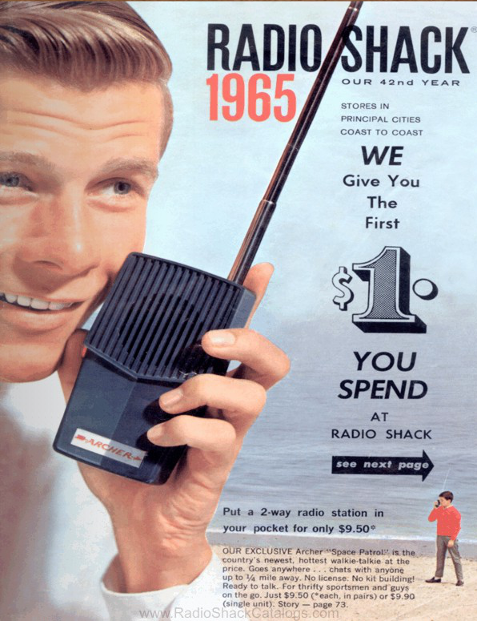

This ad would be considered an example of Cold Media. The user of the the product would still have to fill in gaps of information regarding the tone and inlection of the the voice. 
# week-04-response.md
 

 An example of Cold Media. 
Contextually could be hot or cold depending on the viewer.

 Cold Media
